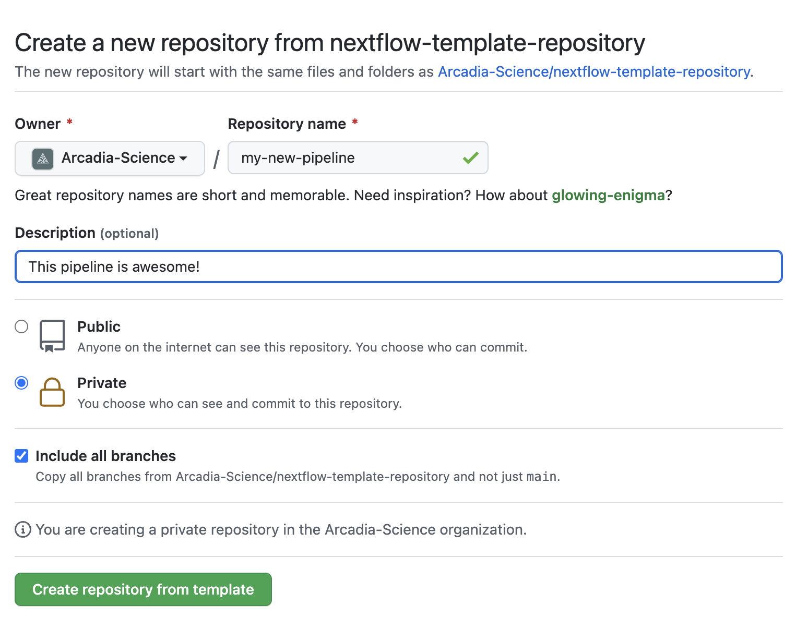

# Template repository for creating new Nextflow pipelines

This GitHub [template repository](https://docs.github.com/en/github/creating-cloning-and-archiving-repositories/creating-a-repository-on-github/creating-a-repository-from-a-template) can be used to create a new repository with the skeleton of a [Nextflow](https://www.nextflow.io/) pipeline, based on the [nextflow-template](https://github.com/Arcadia-Science/nextflow-template) cookiecutter repository.

Once you create a repository using this template, your new repository will execute a GitHub Actions workflow that uses cookiecutter to rewrite the repository to the desired state. This may take 30 seconds or so.

Once the action is done, please rename the `github` directory to `.github`. This is a short-term hack to circumvent GitHub action permission issues.

The GitHub action will also create a `TEMPLATE` branch that's used by `nf-core` to keep modules up-to-date and make following the `nf-core` guidelines easier.

## Credit

This is fully inspired by the following blog post: https://simonwillison.net/2021/Aug/28/dynamic-github-repository-templates/. The README instructions here are modified from [this GitHub repository](https://github.com/simonw/click-app-template-repository).

## Usage

You can click on the "Use this template" button on this repository and follow the prompts. Alternatively, you can start [here](https://github.com/Arcadia-Science/nextflow-template-repository/generate) and follow the prompts. Please follow these instructions:

- The name of your repository will be the name of the Nextflow pipeline.
- Add a one-line description of your pipeline.
- Finally, click "Create repository from template".

